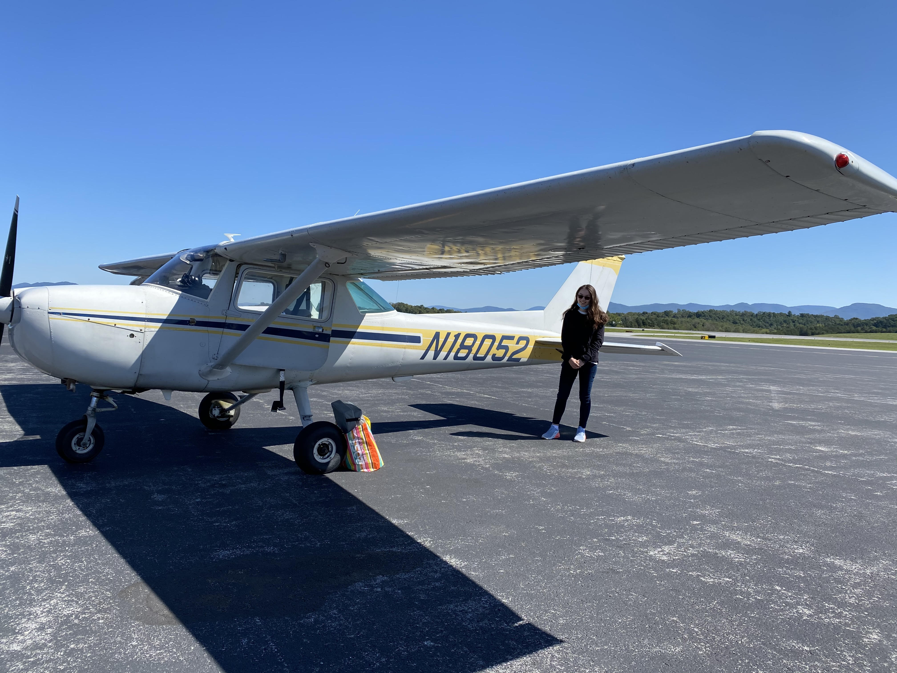

I'm a big fan of this Albert Einstein quote: "I have no special talents. I am only passionately curious." Here are some things I like exploring in my free time!

## Flying

I've been dreaming of going to space since I was 11, and thanks to funding from Mary Baldwin University's Experiential Learning Grant, I was able to get a little closer to that goal. I'm currently working towards obtaining my private pilot certificate and have had the chance to take lessons in Cessna 150, Cessna 172, and Cirrus SR-22 aircraft. 

MBU was kind enough to feature my adventures in the sky on page 26 of [this magazine!](https://issuu.com/marybaldwinu/docs/mbu_magazine-winter2020)

Here's a triumphant photo after I finished my first solo flight: 

## Art

Before coming to MBU, I was an avid participant in student art and jazz music competitions. Since beginning college, I've enjoyed exploring these interests through an academic lens during some arts-related coursework. 

My favorite example of this is my Pinhole Photography course, during which I spent every day of MBU's three-week May Term taking photos using a black-box pinhole camera, developing the paper negatives in a dark room, and even creating my own "camera obscura". After studying imaging applications in my undergraduate math research experiences, I truly loved learning both the art and physics of how photography works in this course. 

Here is a link to some of my work from this class!

## Education

## Reading
